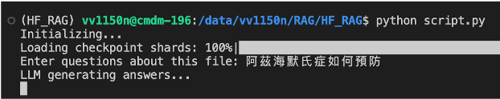

# HF_RAG 環境設置與腳本執行指南

## 先決條件

- 系統已安裝 Conda。
- Python 版本為 3.11。

## 設置步驟

1. **創建 Conda 環境**

   創建一個名為 `HF_RAG` 的 Conda 環境，使用 Python 3.11：

   ```bash
   conda create -n HF_RAG python=3.11
   ```
2. **啟用新建的環境：**

   ```bash
   conda activate HF_RAG
   ```
3. **安裝所需的 Python 套件：**

   ```bash
   pip install -r requirements.txt
   ```
    **單獨安裝 langchain_huggingface：**
    
    ```bash
   pip install langchain_huggingface
    ```
    
4. **執行腳本開始進行問題回答：**

   ```bash
   python script.py
    ```
